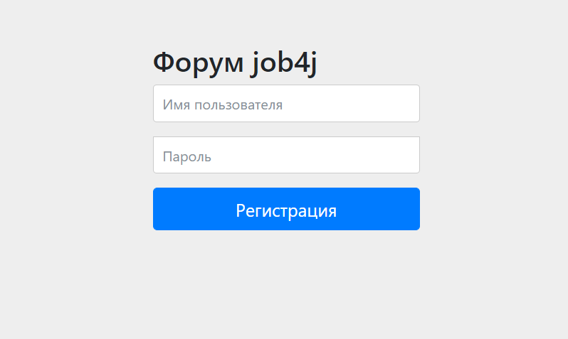

## Реализация форума, с аутентификацией, пользователь может создавать темы, к темам можно писать комментарии

Приложение доступно по [ссылке](https://aqueous-atoll-93246.herokuapp.com/)

### Технологии:

- Spring Boot(Web, Data, Security, Test)
- JSP
- JSTL
- PostgreSQL
- Liquibase
- Maven
- Heroku

### Сборка приложения
- Для сборки приложения на вашем компьютере должны быть установлены:
    - JDK 14+
    - Maven
    - PostgreSQL
- Скачайте проект к себе на компьютер с помощью команды `git clone https://github.com/iudini/job4j_forum`
- В PostgreSQL создайте базу с именем "forum"
- Укажите настройки для подключения к БД в файле `src/main/resources/application.properties`
- Выполните команду `mvn install`
- Далее `java -jar target/job4j_forum-1.0.jar`

Адрес по умолчанию: http://localhost:8080/

### Авторизация

### Регистрация

### Главная страница

### Новое сообщение, форма редактирования

### Комментирование

